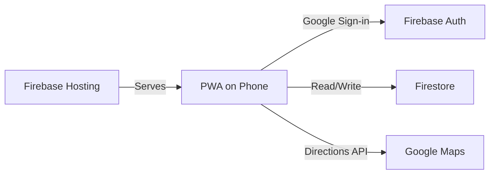

# BatterUp — Order Management PWA

A mobile-first Progressive Web App for managing batter/food orders, customers, products, delivery routing, and analytics. Built with vanilla JavaScript and Firebase.

## Architecture



## Features

- **New Order** — Multi-item orders with customer search, product dropdown, auto-fill pricing, delivery toggle (+€2 fee), and notes
- **Orders** — Upcoming orders grouped by date, search by customer, mark paid/delivered, inline editing
- **Customers** — Add/edit customers with phone, address, notes; view order history and balance
- **Products** — Manage products with default pricing, min order quantities, and raw materials per unit
- **Reports** — Monthly/weekly revenue, order trends, top customers, unpaid tracking, product sales, raw materials summary
- **Tools** — Route planning with Google Maps, raw materials calculator for pending orders, payment reminders
- Google Sign-in (persistent session)
- Offline support via Firestore persistent local cache
- Add to Home Screen (PWA)

## Project Structure

```
batterup/
├── web/                        # PWA frontend (served by Firebase Hosting)
│   ├── index.html              # Single-page app entry point
│   ├── manifest.json           # PWA manifest
│   ├── css/styles.css          # Stylesheet
│   └── js/
│       ├── app.js              # App init, auth, tab switching
│       ├── state.js            # Firebase config, global state, shared constants
│       ├── helpers.js          # Utilities (formatting, modals, toasts)
│       ├── orders.js           # Order CRUD and list rendering
│       ├── customers.js        # Customer management
│       ├── products.js         # Product catalog with raw materials
│       ├── reports.js          # Analytics and KPIs
│       └── tools.js            # Route planning, materials calc, reminders
├── firebase.json               # Firebase hosting & Firestore config
├── firestore.rules             # Security rules (allowlisted users only)
└── firestore.indexes.json      # Firestore composite indexes
```

## Setup

### 1. Firebase Console

1. Go to [Firebase Console](https://console.firebase.google.com/) → select **batter-automations** project
2. **Authentication** → Sign-in method → Enable **Google**
3. **Firestore Database** → Create database (choose `europe-west1`)

### 2. Firebase Config

The Firebase config is in `web/js/state.js`. Update the `firebaseConfig` object if using a different Firebase project.

### 3. Deploy

```bash
firebase deploy
```

Deploys hosting (PWA) and Firestore security rules.

### 4. Use on Phone

1. Open the hosted URL on your phone
2. Sign in with Google
3. Tap "Add to Home Screen" for app-like experience
4. Add products, then start entering orders

### 5. Tools Setup (optional)

#### Google Maps Route Planning

1. Go to [Google Cloud Console](https://console.cloud.google.com/) → APIs & Services → Credentials
2. Create an API key and enable the **Directions API**
3. In Firestore, create a document at `config/settings` with:
   ```json
   {
     "google_maps_api_key": "AIza...",
     "home_address": "Your starting address for deliveries"
   }
   ```

## Local Development

```bash
firebase emulators:start --only hosting,firestore,auth
```

Open http://localhost:5000

## Firestore Collections

### `orders`
| Field | Type | Example |
|-------|------|---------|
| items | array | `[{name, quantity, unit, price}]` |
| customer_name | string | "John" |
| delivery_date | string | "2026-03-15" |
| notes | string | "" |
| needs_delivery | boolean | false |
| delivered | boolean | false |
| paid | boolean | false |
| created_by | string | "user@gmail.com" |
| timestamp | timestamp | (server timestamp) |

### `customers`
| Field | Type | Example |
|-------|------|---------|
| name | string | "John" |
| phone | string | "+353..." |
| address | string | "123 Main St" |
| notes | string | "" |

### `products`
| Field | Type | Example |
|-------|------|---------|
| name | string | "Idly Batter" |
| default_price | number | 5 |
| unit | string | "kg" |
| min_quantity | number | 1 |
| min_unit | string | "kg" |
| raw_materials | array | `[{name, quantity, unit}]` |

### `config/settings`
| Field | Type | Description |
|-------|------|-------------|
| google_maps_api_key | string | Google Maps API key with Directions API enabled |
| home_address | string | Starting address for route planning |

### `routes`
| Field | Type | Description |
|-------|------|-------------|
| date | string | Delivery date for the route |
| timestamp | timestamp | When the route was saved |
| route | object | Optimized route data from Google Maps |
